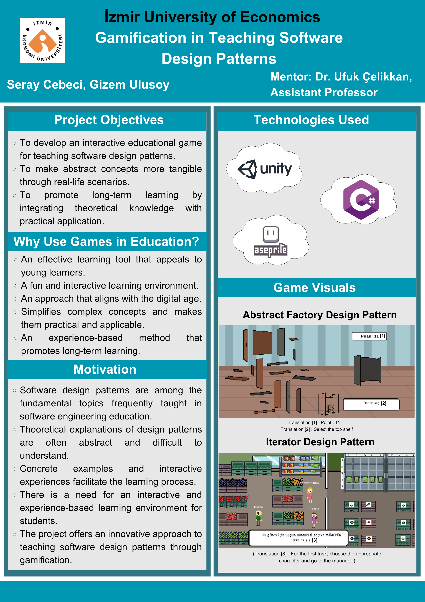

# DesignPatternGameProject
## "Gamification in Teaching Software Design Patterns"

An interactive educational game that teaches software design patterns through real-world analogies.

### 📌 Project Poster

### 📄 Documentation

- [Final Report (PDF)](Docs/FinalReport.pdf)
